# Optique et électromagnétisme

### TP1 — MAJ3B

Guillaume Faye-Bédrin  
[guillaume.faye-bedrin@sorbonne-universite.fr](mailto:guillaume.faye-bedrin@sorbonne-universite.fr)

---

## Calendrier

Mardi de 13h45 à 18h00

| Séance   | Date  | Salle |                 Couloir                 |
| -------- | ----- | :---: | :-------------------------------------: |
| 1        | 22/09 |  116  | <span class="couloir-2232">22/32</span> |
| 2        | 29/09 |  104  | <span class="couloir-2232">22/32</span> |
| 3        | 13/10 |  108  | <span class="couloir-2232">22/32</span> |
| 4        | 20/10 |  105  | <span class="couloir-2333">23/33</span> |
| 5        | 10/11 |  116  | <span class="couloir-2232">22/32</span> |
| 6        | 17/11 |  104  | <span class="couloir-2232">22/32</span> |
| Révision | 08/12 |       |                                         |
| Examen   | 15/12 |       |                                         |

---

## Organisation

- En binôme
- Présence obligatoire
- En cas d'absence : **prévenir** et **rattraper** la séance

---

| Évaluation     |                              |                               |       |
| -------------- | ---------------------------- | ----------------------------- | :---: |
| Interrogations | Début de chaque TP, sauf TP1 | Questions sur le TP du jour   | 5/30  |
| Comptes rendus | Chaque TP, sauf TP3          |                               | 10/30 |
| Examen final   | Fin de semestre              | Refaire des manips vues en TP | 15/30 |

Note:
Absence: 0 à l'interro + CR et désavantagé à l'examen, sauf si rattrapé avec un autre groupe.

**La note de TP1 ne compte pas**

---

## Contenu des TP

|  TP   | Thème                       | Au programme                                                    |
| :---: | --------------------------- | --------------------------------------------------------------- |
|   1   | Formation des images        | Focale d'une lentille, auto-collimation, modèle de l'œil        |
|   2   | Polarisation                | Loi de Malus, lames λ/2 et λ/4, angle de Brewster               |
|   3   | Interféromètre de Michelson | Réglage, lame d'air et coin d'air, doublet du sodium            |
|   4   | Spectroscopies              | Spectromètre à réseau, spectroscopie par transformée de Fourier |
|   5   | Diffraction                 | Conditions de Fraunhofer, fentes, filtrage spatial              |
|   6   | Biréfringence               | Barreau de plexiglas, scotch, spectre cannelé                   |

Note:
à chaque TP, environ 3 manips qui pourront **toutes tomber à l'examen**.

Chaque TP se prépare **avant la séance**<br>
(interro à chaque séance !)

---

# La mesure en physique expérimentale

---

On mesure $x$, mais la valeur vraie $x_0$ est inconnue.

- Erreur $\varepsilon = x - x_0$ : inconnue elle aussi
- Erreurs **aléatoires** (changent d'une mesure à l'autre) et **systématiques** (biais constant)


Note:
- On veut mesurer X. La vraie valeur x₀ est inconnue. On trouve x.
- Erreur : ε = x − x₀, inconnue elle aussi.
- D'où vient l'erreur ?
  - fluctuations aléatoires (vibrations, manipulation…)
  - erreur systématique (paramètre externe : température, étalonnage imparfait…)
- Incertitude : on présente un résultat en donnant l'intervalle dans lequel la vraie valeur se trouve probablement.

Une grande incertitude ne veut pas dire une mauvaise mesure : la constante de Hubble est connue à ~1 %, avec des mesures d'excellente qualité.
Une mauvaise mesure, c'est une mesure qui ne respecte pas les règles de l'art (appareil non étalonné, incertitude non justifiée…).

---

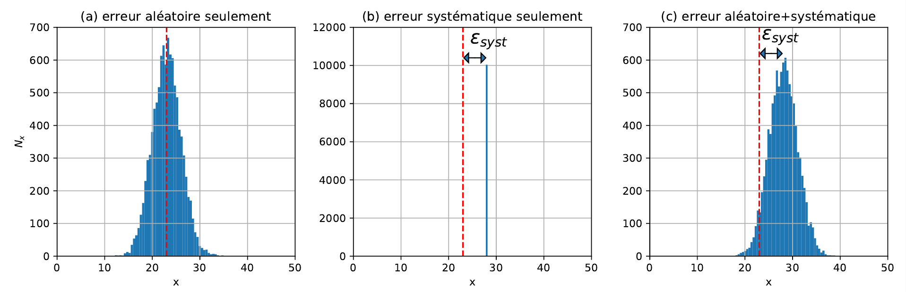

Note:
- (a) erreur aléatoire : les mesures se dispersent autour de la valeur vraie. Moyenner plusieurs mesures réduit cette erreur.
- (b) erreur systématique : toutes les mesures sont décalées de la même quantité. Répéter la mesure ne sert à rien, il faut corriger le protocole (étalonnage, parallaxe…).
- (c) en pratique, les deux se combinent.

---

## Écrire un résultat

$$ X = (\text{meilleure estimation} \pm \text{incertitude}) \times \text{unité} $$

- incertitude $u$ avec **2 chiffres significatifs** maximum
- meilleure estimation $x$ arrondie à la **même décimale** que $u$

|       |                                                                                                              |
| :---: | ------------------------------------------------------------------------------------------------------------ |
|   ✅   | $\alpha = (1{,}23 \pm 0{,}04) \times 10^{8} \ \mathrm{m \cdot s^{-1}}$                                       |
|   ❌   | $\alpha = 1{,}23 \times 10^{8} \ \mathrm{m \cdot s^{-1}} \pm 0{,}04 \times 10^{8} \ \mathrm{m \cdot s^{-1}}$ |
|   ❌   | $\alpha = (12{,}3 \times 10^{7} \pm 4 \times 10^{6}) \ \mathrm{m \cdot s^{-1}}$                              |
|   ❌   | $\lambda = (287{,}333 \pm 4{,}714) \ \mathrm{mm}$                                                            |

Note:
- Écriture scientifique : (meilleure estimation ± incertitude) × 10ⁿ × unité
- u(x) : 2 chiffres significatifs maximum
- x arrondi à la dernière décimale de u(x)

Dernier exemple : la calculatrice donne λ = 287,333… mm et u = 4,714… mm → on écrit λ = (287,3 ± 4,7) mm.

---

## Identifier les sources d'erreur

- **Résolution** de l'instrument : graduations, dernier chiffre affiché
- **Reproductibilité** : refaire la mesure donne-t-il la même valeur ?
- **Plage d'observation** : sur quelle distance l'image reste-t-elle nette ?
- **Notice** constructeur : précision de l'appareil
- **Biais** : le centre de la lentille est-il bien au-dessus de l'index du banc ?

Note:
Premier réflexe : prendre la résolution de l'instrument. Souvent insuffisant !
En optique, c'est souvent la plage de netteté qui domine (plusieurs mm, voire 1 cm), bien plus que la graduation du banc (1 mm).

---

## Estimer l'incertitude-type

**Type A** : mesure répétée $n$ fois

$$ \bar x = \frac{1}{n} \sum_i x_i \qquad u(\bar x) = \frac{\sigma_n}{\sqrt{n}} $$

**Type B** : mesure unique (le cas le plus fréquent en TP)

Note:
Type B: limites des instruments

---

### Incertitude de type B

|                                                     Distribution                                                     | Quand ?                                                                                                     |                                         $u(x)$                                         |
| :------------------------------------------------------------------------------------------------------------------: | ----------------------------------------------------------------------------------------------------------- | :------------------------------------------------------------------------------------: |
|     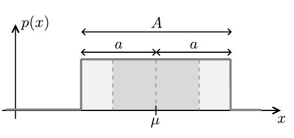Uniforme     | graduations, précision de la notice...                                                                      | <span style="white-space: nowrap;">$\dfrac{A}{\sqrt{12}} = \dfrac{a}{\sqrt{3}}$</span> |
| 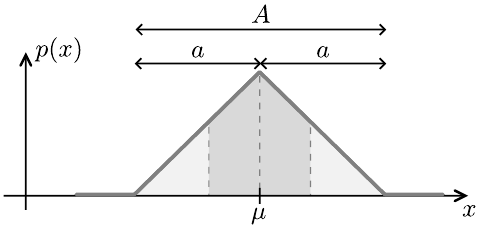Triangulaire | différence ou somme de valeurs lues sur graduations, valeurs centrales plus probables (plage de netteté)... | <span style="white-space: nowrap;">$\dfrac{A}{\sqrt{24}} = \dfrac{a}{\sqrt{6}}$</span> |
|   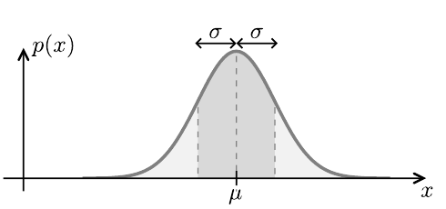Gaussienne   | valeur tabulée, résultat d'un article                                                                       |                                        $\sigma$                                        |

Note:
Type A : l'incertitude décroît en 1/√n. Pour gagner un facteur 10, il faut 100 fois plus de mesures.
Répéter ne réduit que la partie aléatoire : lire 10 fois la même graduation ne divise pas u par √10.

Il faut choisir une distribution adaptée.
En pratique souvent loi uniforme

---

## Exemples en TP

**Plage de netteté** : l'image reste nette sur 20 mm (triangulaire)
$$ u(x_\text{écran}) = \frac{20 \ \mathrm{mm}}{\sqrt{24}} \approx 4 \ \mathrm{mm} $$

**Multimètre** : on lit $0,376\ \mathrm{V}$, notice $2u = (0,8 \\% + 1\ \text{digit})$
$$ u = \frac{1}{2} \times (0{,}008 \times 0{,}376 + 0{,}001) \approx 0{,}004 \ \mathrm{V} $$

**Signal périodique** : mesurer $N$ interfranges d'un coup, puis $u(i) = u(N i) / N$

Note:
Pour la notice, la précision constructeur est la demi-largeur a de la loi uniforme : u = a/√3 = A/√12.

---

## Propager une incertitude

<div class="interactive" data-src="figures/propagation_demo.js"></div>

Note:
L'intervalle x ± u(x) est transporté par f : sa largeur est multipliée par la pente de f.
Curseur : plus f est raide, plus l'incertitude sur f(x) est grande.

---

## Propager une incertitude : une seule variable

$G = f(x)$ : on linéarise $f$ autour de $x_m$

$$ u(G) = \left\lvert \frac{\mathrm{d}f}{\mathrm{d}x}(x_m) \right\rvert u(x) $$

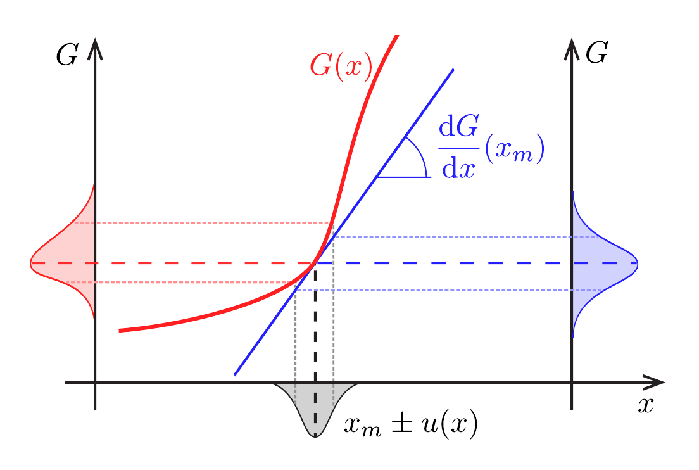

Note:
La distribution de x (en gris) est transformée par G(x) (en rouge). En remplaçant G par sa tangente (en bleu), la largeur est simplement multipliée par la pente.
Exemple : volume d'une bille V = πD³/6, avec D = (12,35 ± 0,05) mm → u(V) = (πD²/2) u(D) ≈ 12 mm³, soit V = (986 ± 12) mm³.

---

## Deux variables

$z = x + y$, avec $x$ et $y$ indépendants

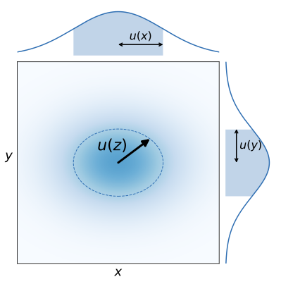

$$ u(z)^2 = u(x)^2 + u(y)^2 $$

Note:
Les incertitudes s'ajoutent comme les côtés d'un triangle rectangle : en quadrature, pas en somme simple.
Pourquoi pas u(x) + u(y) ? Ce serait le pire cas, où x et y se trompent toujours dans le même sens. Or les erreurs indépendantes ont une chance sur deux de se compenser.
Même résultat pour z = x − y.

---

## Cas général

$G = f(x_1, \dots, x_n)$ avec des $x_i$ indépendants :

$$ u(G)^2 = \sum_i \left( \frac{\partial f}{\partial x_i} \right)^2 u(x_i)^2 $$

| Exemple                | Formule                                                                                                            |
| ---------------------- | ------------------------------------------------------------------------------------------------------------------ |
| $G = x \pm y$          | $u(G)^2 = u(x)^2 + u(y)^2$                                                                                         |
| $G = x^\alpha y^\beta$ | $\left( \frac{u(G)}{G} \right)^2 = \left( \alpha \frac{u(x)}{x} \right)^2 + \left( \beta \frac{u(y)}{y} \right)^2$ |

**Terme dominant** : si une incertitude relative est 3 à 4 fois plus grande que les autres, on néglige les autres.

Note:
Exemple : distance lentille–écran L = x_écran − x_lentille, avec u = 0,5 cm et 1,0 cm → u(L) = √(0,5² + 1,0²) ≈ 1,1 cm.
On somme les carrés, pas les incertitudes : les erreurs ont une chance sur deux de se compenser.

---

<!-- .slide: data-visibility="hidden" -->
## Propager par Monte-Carlo

1. Tirer $N$ valeurs de chaque $x_i$ dans sa distribution
2. Calculer les $N$ valeurs de $G$ correspondantes
3. Meilleure estimation = moyenne, $u(G)$ = écart-type

```python
import numpy as np

N = 100_000
OA  = np.random.uniform(-30.5, -29.5, N)  # position objet (cm)
OAp = np.random.uniform(58.0, 62.0, N)    # position image, plage de netteté (cm)
f = 1 / (1/OAp - 1/OA)                    # relation de conjugaison
print(f.mean(), f.std())                  # ≈ 20.0 et 0.18
```

Note:
Utile dès que la formule devient pénible à dériver.
Ici : f' = (20,00 ± 0,18) cm.

---

## Comparer à une valeur de référence

$$ z = \frac{\lvert x - x_\text{ref} \rvert}{\sqrt{u(x)^2 + u_\text{ref}^2}} $$

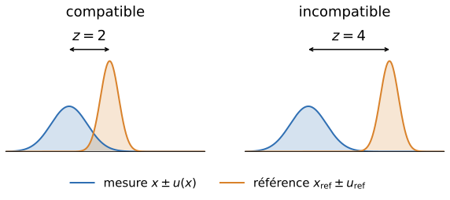

| z-score         | Conclusion                                   |
| --------------- | -------------------------------------------- |
| $z \le 2$       | accord avec la référence                     |
| $2 \lt z \le 3$ | doute                                        |
| $z \gt 3$       | désaccord : chercher une erreur systématique |

Note:
Pour une gaussienne, la référence est hors de ±u dans 32 % des cas : c'est normal !
Hors de ±2u : 5 %, hors de ±3u : 0,3 %.
Si la référence n'a pas d'incertitude, u_ref = 0.

---

## Vérifier une loi ajustée

$$ \chi^2 = \sum_i \left( \frac{y_i - f(x_i)}{u(y_i)} \right)^2 \qquad \chi^2_\text{red} = \frac{\chi^2}{N - p} $$

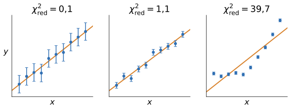

|         $\chi^2_\text{red} \ll 1$          |     $\chi^2_\text{red} \sim 1$     | $\chi^2_\text{red} \gt 2$ |
| :----------------------------------------: | :--------------------------------: | :-----------------------: |
| barres d'erreur trop grandes pour conclure | modèle compatible avec les données |       modèle rejeté       |

Note:
N points, p paramètres ajustés (p = 2 pour une droite). <br>
somme d'écart au modèle sur incertitude au carré

---

<!-- .slide: data-visibility="hidden" -->
## Ajustement en Python

```python
import numpy as np
from scipy.optimize import curve_fit

def modele(x, a, b):
    return a * x + b

popt, pcov = curve_fit(modele, x, y, sigma=u_y, absolute_sigma=True)
u_popt = np.sqrt(np.diag(pcov))           # incertitudes sur a et b

residus = (y - modele(x, *popt)) / u_y
chi2_red = np.sum(residus**2) / (len(x) - len(popt))
```

Note:
absolute_sigma=True : sinon curve_fit renormalise les incertitudes et u_popt n'a plus de sens.
Attention à polyfit : sans l'option w=1/u_y, l'ajustement n'est pas pondéré.

---

## Dans vos comptes rendus

- Identifier les **sources d'erreur**
- **Justifier** chaque incertitude-type
- Écrire les résultats correctement
- **Comparer** : z-score (une valeur) ou $\chi^2_\text{red}$ (ajustement)
- Vocabulaire précis : pas « assez faible », mais « $a$ petit devant $b$ »

$\to$ *La mesure en physique expérimentale* sur Moodle

---

# TP1 : formation des images

---

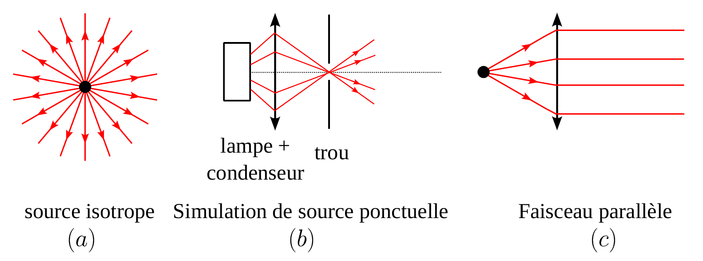

Note:
Figure 1.1 : source isotrope, simulation de source ponctuelle (lampe + condenseur + trou), faisceau parallèle.

---

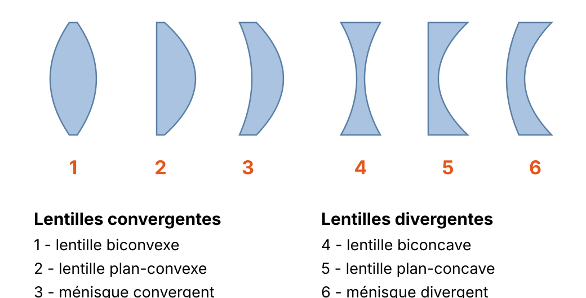

Note:
Figure 1.2 : lentilles convergentes (bords plus minces que le centre) et divergentes.

---

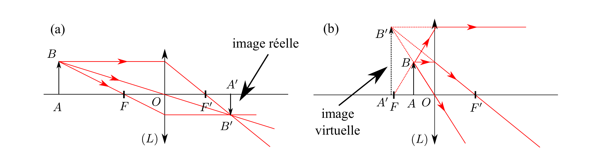

Note:
Figure 1.3 : un objet réel AB a une image réelle (a) ou virtuelle (b) selon sa position par rapport à la lentille.

---

## Conditions de Gauss

- rayons **paraxiaux** : proches de l'axe optique
- rayons **peu inclinés** par rapport à l'axe optique

⟹ **stigmatisme** et **aplanétisme** approchés

Note:
- Stigmatisme : à un point objet correspond un unique point image. Les deux points sont dits conjugués.
- Aplanétisme : deux points objets d'un même plan orthogonal à l'axe optique ont leurs images dans un même plan orthogonal à l'axe.
- Rigoureux pour très peu de systèmes : le miroir plan (pour tout point de l'espace), le miroir parabolique (entre l'infini et son foyer, d'où son usage en astronomie).
- Hors des conditions de Gauss : aberrations géométriques (voir plus loin).

---

## Lentilles minces

- épaisseur **négligeable** devant les rayons de courbure
- rayon passant par le centre $O$ : **non dévié**
- $F$ et $F'$ **symétriques** par rapport à $O$
- distance focale $f'$, vergence $\delta = 1/f'$ en dioptries
- $f' \gt 0$ convergente, $f' \lt 0$ divergente

Note:
La distance focale est une grandeur algébrique : f' = OF' (barre), positive pour une lentille convergente, négative pour une divergente.
Une lentille mince est entièrement caractérisée par f' (ou par sa vergence).

---

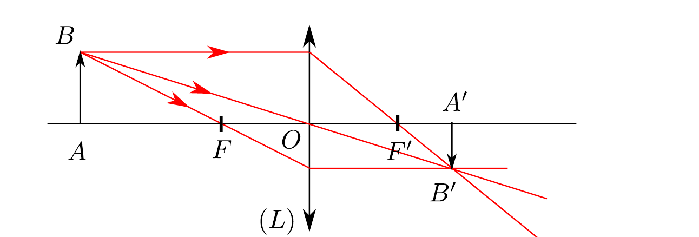

<br>

- Descartes $$ \frac{1}{\overline{OA'}} - \frac{1}{\overline{OA}} = \frac{1}{f'} $$
- Newton $$ \overline{FA} \cdot \overline{F'A'} = -f'^2 $$

Note:
Figure 1.4 : les trois rayons particuliers. Deux suffisent pour construire l'image.
1. les rayons passant par le centre O ne sont pas déviés ;
2. les rayons passant par F émergent parallèlement à l'axe optique ;
3. les rayons arrivant parallèlement à l'axe optique émergent en pointant vers F'.
Un objet à l'infini a son image dans le plan focal image, et réciproquement.
Attention : F et F' ne sont pas conjugués l'un de l'autre.

---

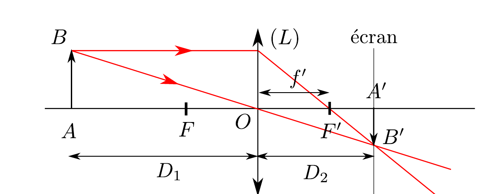

$$ D_1^2 - D D_1 + D f' = 0 \qquad \Delta = D^2 - 4 f' D $$

- $D \lt 4f'$ : aucune position de la lentille ne donne d'image sur l'écran
- $D = 4f'$ : une seule position, à $2f'$ de l'objet et de l'écran (Silbermann)
- $D \gt 4f'$ : deux positions possibles (Bessel)

Note:
Figure 1.5 : distances objet-lentille D₁, lentille-image D₂ et objet-écran D.
À D fixée, on écrit D₁ = D − D₂ dans la relation de conjugaison : c'est une équation du second degré en D₁.
Dans la configuration 4f', le grandissement vaut 1 en valeur absolue.

---

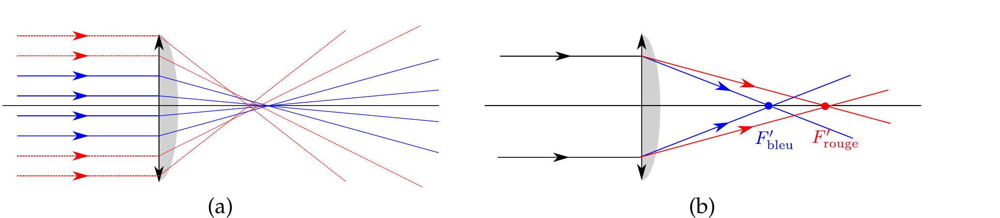

Note:
Figure 1.6 : (a) Lentille convergente éclairée par une onde plane sur toute sa surface. Plus les rayons sont loin de l'axe optique et arrivent sur les bords de la lentille, plus ils convergent proches de la lentille. Pour avoir un stigmatisme approché, il faut se restreindre aux rayons vérifiant les conditions de Gauss (en bleu traits pleins). (b) Un faisceau de lumière blanche éclaire une lentille : les rayons de différentes longueurs d'onde convergent en des foyers différents.

---

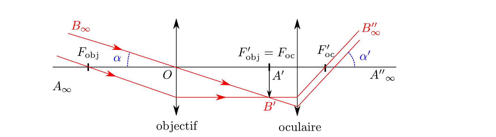

$$ G = \frac{\alpha'}{\alpha} $$

Note:
Figure 1.7 : lunette astronomique, système afocal. Le foyer image de l'objectif et le foyer objet de l'oculaire sont confondus.

---

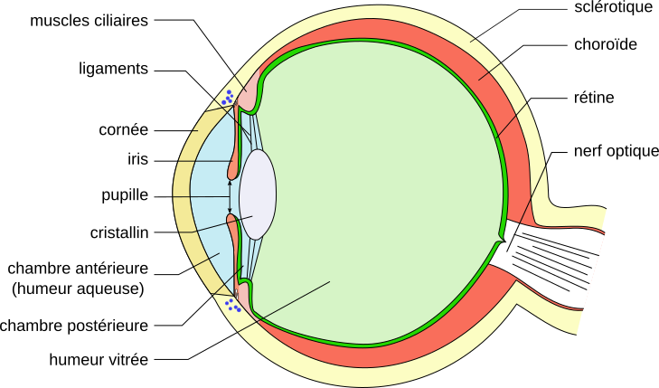

Note:
Figure 1.8 : coupe de l'œil. Le cristallin projette l'image sur la rétine ; accommoder change sa distance focale.

---

<div class="interactive" data-src="figures/oeil_demo.js"></div>

Note:
Curseurs : position de l'objet et distance focale du cristallin.
La tache orange sur la rétine est l'étendue des rayons : elle se réduit à un point quand l'image se forme exactement sur la rétine, c'est l'accommodation.
Objet plus près que le foyer : les rayons sortent divergents, l'image est virtuelle (prolongements en pointillés) et rien ne se forme sur la rétine.

